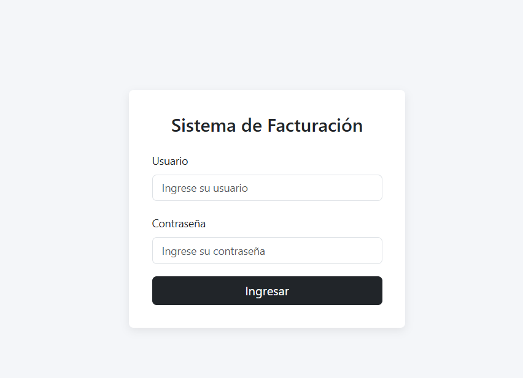
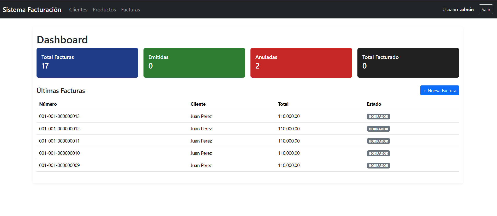
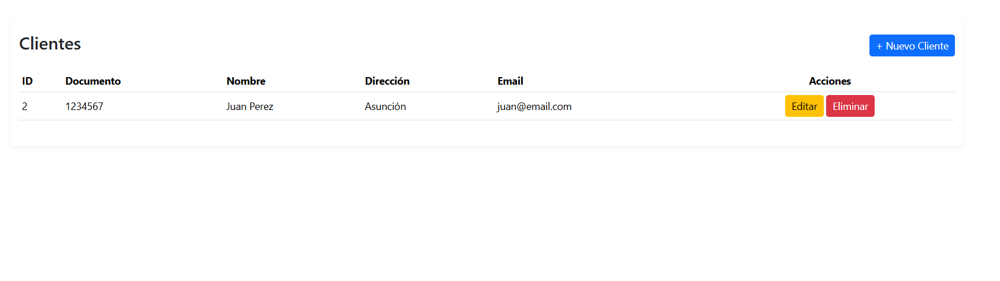
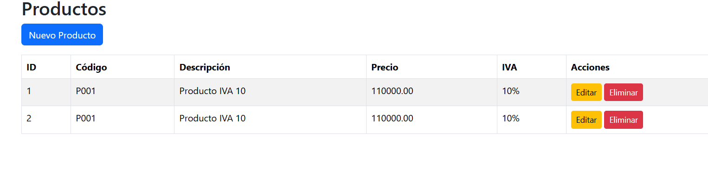
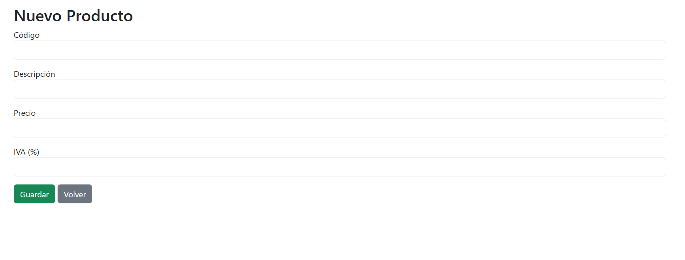
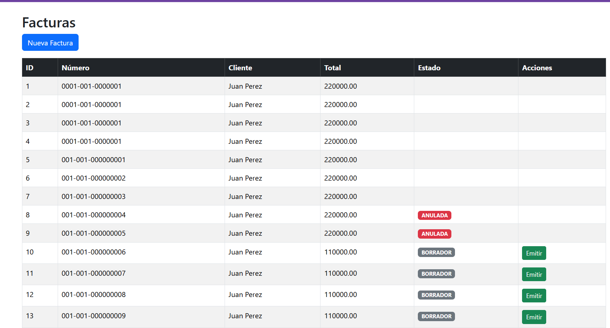
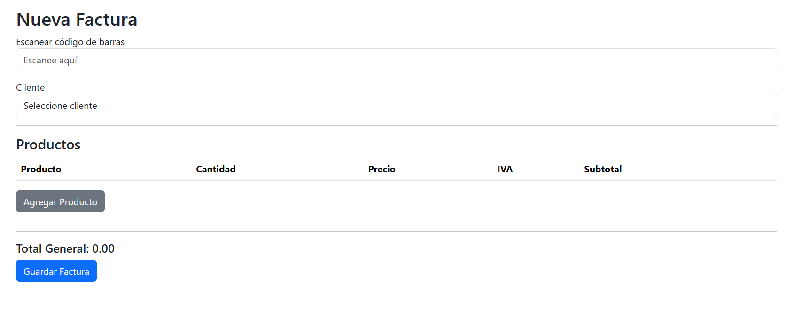
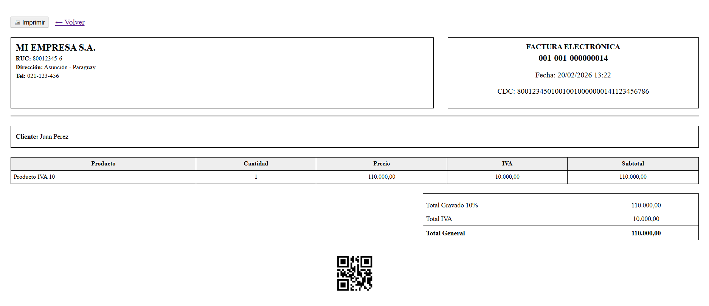

# Sistema de Facturación Electrónica - Spring Boot

Sistema de facturación desarrollado con Spring Boot, Thymeleaf y JPA.

## 🚀 Tecnologías

- Java 17
- Spring Boot
- Spring Security
- Thymeleaf
- JPA / Hibernate
- Bootstrap 5
- PostgreSQL

## 📌 Funcionalidades

- Gestión de clientes
- Gestión de productos
- Generación de facturas
- Cálculo automático de IVA (5% y 10%)
- Generación de CDC
- Generación de XML
- Vista previa imprimible
- Código QR
- Lector de código de barras
- Autenticación con Spring Security

## 🖨 Vista previa e impresión

Las facturas pueden visualizarse antes de imprimirse, con formato empresarial clásico y código QR integrado.

## 🔐 Seguridad

Autenticación mediante Spring Security con control de acceso.

## 📷 Capturas

### 🔐 Login

---

### 📊 Dashboard

---

### 👥 Gestión de Clientes

#### Lista de Clientes

#### Nuevo Cliente

---

### 📦 Gestión de Productos

#### Lista de Productos

#### Nuevo Producto

---

### 🧾 Gestión de Facturas

#### Lista de Facturas

#### Nueva Factura

#### Vista Previa / Impresión

## 🧠 Autor

Shirley